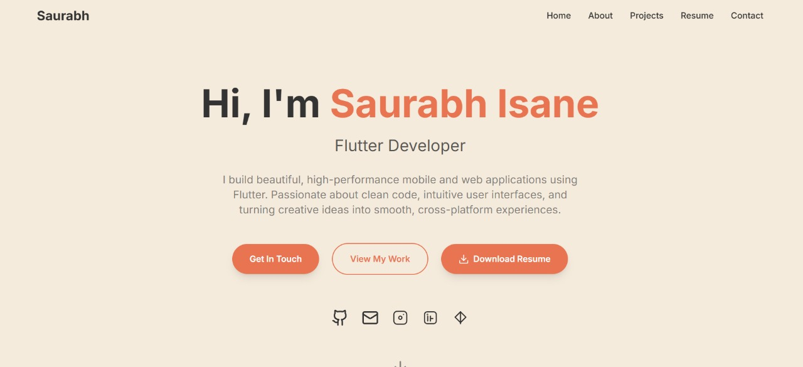
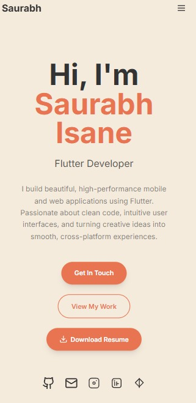

<div align="center">

# 🌟 Saurabh Isane's Developer Portfolio


<br/>

[](https://reliable-bavarois-3e85ca.netlify.app/)
[](https://www.linkedin.com/in/saurabh-isane-479a0a257/?originalSubdomain=in)
[](https://github.com/saurabhisane)
[](mailto:isanesaurabh@gmail.com)

<br/>


</div>

---

<div align="center">

## 🎨 *"Where Code Meets Creativity"*

*A modern, responsive portfolio showcasing my journey as a developer — built with passion, powered by React, and styled with elegance.*

</div>

---

## 🖼️ **Portfolio Showcase**

<div align="center">

### 🖥️ **Desktop Experience**


### 📱 **Mobile Experience**  


<sub>📸 *Screenshots are located in the `screenshots/` directory - update paths as needed*</sub>

</div>

---

## 🛠️ **Technology Arsenal**

<div align="center">

<table>
<thead>
<tr>
<th>🚀 Technology</th>
<th>💡 Purpose</th>
<th>⭐ Why I Chose It</th>
</tr>
</thead>
<tbody>
<tr>
<td></td>
<td>Frontend Framework</td>
<td>Component-based, virtual DOM, huge ecosystem</td>
</tr>
<tr>
<td></td>
<td>CSS Framework</td>
<td>Utility-first, rapid prototyping, consistent design</td>
</tr>
<tr>
<td></td>
<td>Build Tool</td>
<td>Super fast HMR, optimized builds, modern tooling</td>
</tr>
<tr>
<td></td>
<td>Email Service</td>
<td>Client-side email sending, no backend required</td>
</tr>
</tbody>
</table>

</div>

---

## 🚀 **Quick Start Guide**

<div align="center">

### 💻 **Get It Running in 3 Steps!**

</div>

```bash
# 📥 1. Clone the magic
git clone https://github.com/saurabhisane/my_portfolio.git
cd my_portfolio

# 📦 2. Install dependencies
npm install

# 🔥 3. Launch development server
npm run dev
```

<div align="center">

**🎉 That's it! Your dev server is now running at `http://localhost:5173`**

</div>

### 🏗️ **Additional Commands**

```bash
# 🏭 Build for production
npm run build

# 👀 Preview production build
npm run preview

# 🧹 Lint your code
npm run lint

# 🎨 Format with Prettier
npm run format
```

---

## 📁 **Project Architecture**

<div align="center">

*Clean, organized, and scalable structure*

</div>

```
my_portfolio/
├── 📁 public/                 # Static assets & favicon
├── 📁 src/
│   ├── 📁 assets/            # Images, icons, and media files
│   │   ├── 🖼️ images/        # Portfolio images
│   │   └── 🎨 icons/         # Custom icons and logos
│   ├── 📁 components/        # Reusable UI components
│   │   ├── 🧭 Navbar.jsx     # Navigation component
│   │   ├── 🦶 Footer.jsx     # Footer component
│   │   ├── 🌙 ThemeToggle.jsx # Dark mode toggle
│   │   └── 📧 ContactForm.jsx # Contact form with EmailJS
│   ├── 📁 pages/             # Main page sections
│   │   ├── 🏠 Home.jsx       # Landing/hero section
│   │   ├── 👨‍💻 About.jsx      # About me section
│   │   ├── 💼 Projects.jsx   # Projects showcase
│   │   └── 📞 Contact.jsx    # Contact section
│   ├── 📁 hooks/             # Custom React hooks
│   ├── 📁 utils/             # Utility functions
│   ├── 🎨 index.css          # Global styles
│   ├── ⚛️ App.jsx           # Main application component
│   └── 🚀 main.jsx          # Entry point
├── 📄 index.html            # Main HTML template
├── ⚙️ package.json          # Dependencies and scripts
├── 🎨 tailwind.config.js    # Tailwind configuration
└── ⚡ vite.config.js        # Vite configuration
```

---

## 🌟 **Key Highlights**

<div align="center">

<table>
<tr>
<td align="center" width="33%">

<h3>🎨 Modern Design</h3>
<p>Clean, minimalist interface with attention to detail and user experience</p>
</td>
<td align="center" width="33%">

<h3>📱 Responsive</h3>
<p>Seamlessly adapts to all screen sizes and devices for optimal viewing</p>
</td>
<td align="center" width="33%">

<h3>⚡ Performance</h3>
<p>Optimized for speed with lazy loading and efficient code splitting</p>
</td>
</tr>
</table>

</div>

---

## 📄 **License & Usage**

<div align="center">

This portfolio is open source and available under the **MIT License**.

Feel free to fork, modify, and use it as inspiration for your own portfolio!

*If you found this helpful, a ⭐ would mean the world to me!*

</div>

---

<div align="center">

## 🎉 **Thank You for Visiting!**


*Made with ❤️ and lots of ☕ by **Saurabh Isane***

---


**"Every great developer you know got there by solving problems they were unqualified to solve until they actually did it."**

</div>
